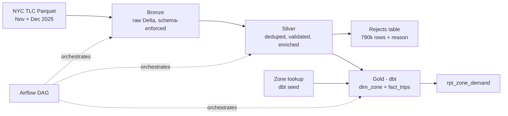

# NYC Taxi Demand Lakehouse

A Databricks medallion pipeline that cleans 8.5M real NYC yellow taxi trips and models pickup demand by zone, day of week, and hour — so taxi supply can be matched to weekday and weekend demand.

---

## Headline results

- **Real, messy source data** — 8,486,450 NYC TLC yellow taxi trips (November + December 2025), not synthetic
- **Full medallion architecture** — Bronze → Silver → Gold on Databricks with Delta Lake
- **Quarantine-based data quality** — 7 validation rules; 790,459 rows (~9.3%) moved to a rejects table *with a reason*, never silently deleted
- **Dimensional model in dbt** — star schema (`dim_zone`, `fact_trips`) plus a reporting model, covered by 5 passing tests including referential integrity
- **Orchestrated end to end** — Airflow DAG triggers the Databricks jobs and the dbt build in dependency order

---

## Architecture



| Layer | Tool | Output | Rows |
|---|---|---|---|
| Bronze | PySpark notebook | `bronze.bronze_yellowtaxi` | 8,486,450 |
| Silver | PySpark notebook | `silver.silver_yellowtaxi` | 7,695,991 |
| Silver | PySpark notebook | `silver.reject_yellowtaxi` | 790,459 |
| Gold | dbt | `gold.dim_zone` | 265 |
| Gold | dbt | `gold.fact_trips` | 37,913 |
| Gold | dbt | `gold.rpt_zone_demand` | — |

---

## Tech stack

Databricks (serverless, Unity Catalog) · PySpark · Delta Lake · dbt Core (`dbt-databricks`) · Apache Airflow 3 · Docker · GitHub

---

## Layer by layer

### Bronze — raw, faithful copy
- Reads monthly TLC Parquet files from a Unity Catalog volume
- **Explicit schema enforced on read**, so an upstream schema change fails loudly instead of corrupting downstream tables
- Adds `ingestion_timestamp` and a `year_month` partition column derived from pickup time
- No cleaning — dirty rows (including stray 2008/2009 timestamps) are kept on purpose so every downstream issue can be traced back to source

### Silver — clean, validate, enrich
- `dropDuplicates()` as a defensive guard (source data had zero duplicates, but future monthly files are unvalidated)
- Derived columns for the gold grain: `pickup_hour`, `pickup_day_of_week`, `is_weekend`, `trip_duration` (seconds)
- Every row tagged with a first-match-wins `reject_reason`, then split into a clean table and a rejects table
- `passenger_was_null` flag instead of dropping the ~26% of rows with missing passenger count
- `updated_at` lineage stamp on both tables

### Gold — star schema in dbt
- `taxi_zone_lookup` loaded as a **dbt seed** (static reference data, 265 zones)
- `dim_zone` — one row per zone: `zone_id`, `zone_name`, `borough`, `service_zone`
- `fact_trips` — grain: **zone × day of week × hour**; measures: `trip_count`, `avg_fare`, `avg_trip_distance`, `avg_trip_duration`
- `rpt_zone_demand` — fact joined to dimension for readable, report-ready output
- Silver tables referenced via `source()`; dbt-built models via `ref()` for lineage and build order

### Orchestration — Airflow
- DAG `nyc_taxi_pipeline`: `bronze >> silver >> gold`
- Bronze and silver run as Databricks Jobs via `DatabricksRunNowOperator`
- Gold runs `dbt build` (models + tests in dependency order) from the Airflow container
- Databricks token read from an Airflow Variable at runtime and passed to dbt as an environment variable — no credentials in any file

---

## Data quality rules

Rules are applied in order; each rejected row keeps the first rule it failed.

| Rule | Condition | Rows rejected |
|---|---|---|
| `negative_fare` | `fare_amount < 0` or `total_amount < 0` | 411,159 |
| `zero_distance` | `trip_distance == 0` | 258,731 |
| `zero_duration` | dropoff == pickup | 118,704 |
| `reversed_trip` | dropoff before pickup | 1,437 |
| `distance_outlier` | `trip_distance > 100` miles | 397 |
| `bad_timestamp` | pickup month outside the loaded months | 24 |
| `invalid_passenger` | `passenger_count > 6` | 7 |
| **Total** | | **790,459** |

Clean + rejected = 8,486,450, reconciling exactly to bronze.

---

## Key design decisions

**Quarantine instead of delete.** Bad rows go to a rejects table with a reason. If anyone asks where 790k rows went, the answer is a query, not "trust me."

**Union-then-single-write in bronze.** An early version looped over monthly files with dynamic partition overwrite. December's file contains a few trips that started on November 30, so the December write overwrote the entire November partition — 4.18M rows replaced by 9. Reading all files, unioning them, and writing once fixed it. Dynamic partition overwrite is unsafe when multiple source files write to overlapping partitions.

**Grain of zone × day of week × hour.** A driver's real question is "where should I be on Friday at 6pm?" — hour alone can't separate weekday commutes from weekend nightlife, and day alone can't separate 8am from 8pm. The tradeoff is thinner buckets for quiet zones at off-peak hours.

**`dropDuplicates()` instead of a `row_number()` window.** Duplicate taxi trips are exact copies, so there is no "latest version" to choose. Window-based dedup is for version selection or much larger scale; here it would be over-engineering.

**No SCD Type 2.** The only dimension is the TLC zone lookup, which is static reference data. Rebuilding it each run (Type 1) is correct; adding history tracking would model changes that never happen.

**Skinny fact table.** `fact_trips` holds keys and measures only; zone names live in `dim_zone` and are joined at query time.

---

## Findings

- **Negative fares were the largest defect** — 411,159 rows (~5% of all trips), far more than expected. These are consistent with refunds, voids, and disputes rather than random corruption.
- **Zero-distance trips outnumber zero-duration trips** (258k vs 119k). Many trips recorded time but no movement — a separate failure pattern from instantly cancelled trips.
- **JFK (zone 132) has a distinct trip signature** — around $60 average fare and 14 miles per trip, versus roughly $17 and 2.5 miles for typical Manhattan zones.
- **Demand is concentrated** — a small set of Manhattan zones and the airports account for the busiest zone/hour combinations.

---

## Repository structure

```
.
├── bronze.ipynb                      # Bronze ingestion notebook
├── silver.ipynb                      # Silver cleaning + quarantine notebook
├── nyc_gold/                         # dbt project (gold layer)
│   ├── models/gold/                  # dim_zone, fact_trips, rpt_zone_demand, schema.yml
│   ├── models/source/sources.yml     # silver tables declared as sources
│   ├── seeds/taxi_zone_lookup.csv
│   └── macros/generate_schema_name.sql
└── airflow/dags/nyc_taxi_pipeline.py # Orchestration DAG
```

---

## How to run

1. **Data** — download Yellow Taxi Parquet files and the Taxi Zone Lookup CSV from the [NYC TLC Trip Record Data page](https://www.nyc.gov/site/tlc/about/tlc-trip-record-data.page) and upload the Parquet files to a Unity Catalog volume.
2. **Bronze and silver** — import the notebooks into Databricks and create a Databricks Job for each.
3. **Gold** — install dbt:
   ```bash
   pip install dbt-databricks
   export DBT_DATABRICKS_TOKEN=<your-token>
   cd nyc_gold
   dbt seed && dbt build
   ```
   `profiles.yml` reads the token from the `DBT_DATABRICKS_TOKEN` environment variable.
4. **Orchestration** — in Airflow, create a `databricks_default` connection and a `databricks_token` Variable, set the two job IDs in the DAG, mount `nyc_gold` under `/opt/airflow/include/`, and trigger `nyc_taxi_pipeline`.

---

## Limitations and next steps

- **Two months of data** — enough to show incremental loading and partitioning, not enough for seasonal trends.
- **Serverless compute** — Spark configs such as AQE settings are locked, so skew tuning was limited to observation rather than toggling optimizations.
- **Next:** incremental file ingestion with Databricks Auto Loader instead of a fixed file list.
